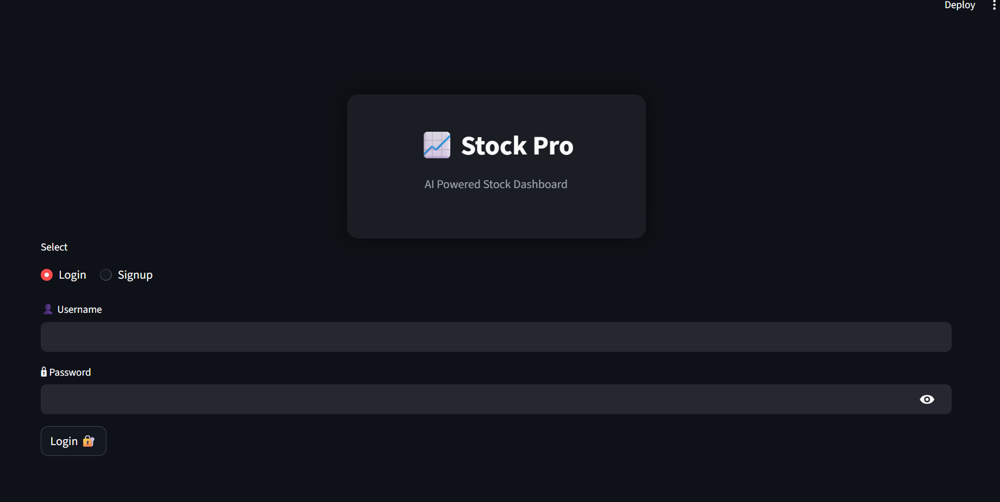
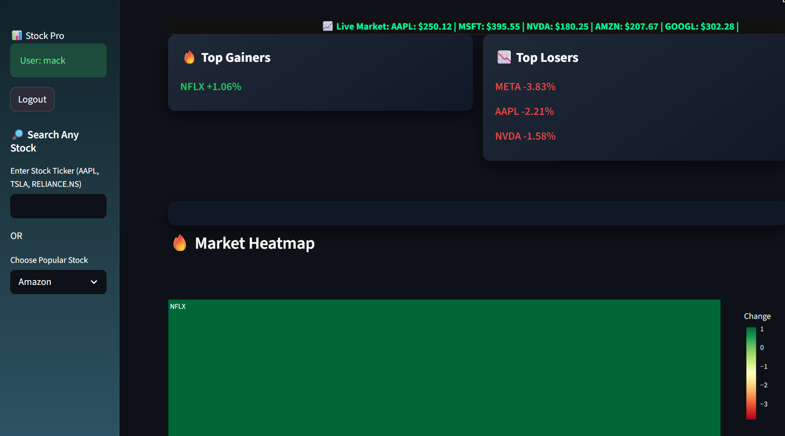
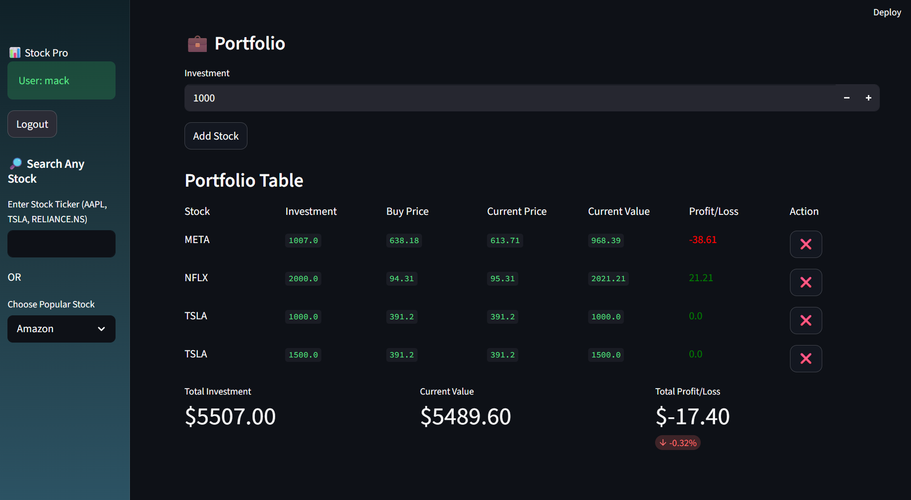
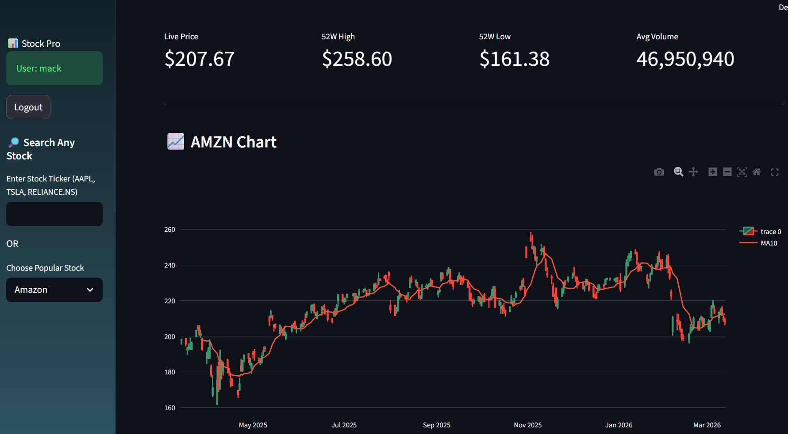

# 📈 Stock Pro Dashboard


An **AI-Powered Stock Market Dashboard** built using **Python and Streamlit** that allows users to track live stock prices, analyze technical indicators, manage investment portfolios, and view AI-based predictions.

This project demonstrates **data visualization, machine learning, financial analysis, and user authentication** in a single interactive dashboard.

---

# 🚀 Key Features

## 📊 Stock Market Analytics
- 📈 Live stock price tracking
- 🕯️ Interactive candlestick charts
- 📉 Moving Average (MA10)
- 📊 RSI Indicator
- 📉 MACD Indicator
- 🔥 Market Heatmap
- 🟢 Top Gainers
- 🔴 Top Losers

## 🤖 AI Stock Prediction

Machine learning models are used to analyze historical stock prices and predict potential trends.

Models implemented:

- **Linear Regression**
- **Random Forest Regressor**

Users can visually compare:

- Actual price trend
- AI predicted trend

## 💼 Portfolio Management

Users can create and manage a personal investment portfolio.

Features include:

- Add stocks to portfolio
- Track investment value
- Real-time profit / loss calculation
- Portfolio allocation visualization
- Interactive **Portfolio Pie Chart**

## 🔐 Authentication System

Secure authentication system with:

- User **Signup / Login**
- **SHA256 password hashing**
- Individual user portfolios
- SQLite database storage

## 💰 Investment Tools

### Investment Profit Calculator

Simulate historical investments to see potential returns.

Features:
- Choose investment date
- Calculate shares purchased
- View current value
- Profit/Loss percentage

## 📚 Learning Section

The dashboard also includes a **learning module** for beginners.

Includes:

- Investment tutorials
- Stock market glossary
- Beginner to advanced trading concepts

---

# 🛠 Tech Stack

| Technology   | Purpose |
|--------------|--------|
| Python       | Core programming language |
| Streamlit    | Web dashboard framework |
| Pandas       | Data analysis |
| NumPy        | Numerical computing |
| Plotly       | Interactive charts |
| yFinance API | Stock market data |
| Scikit-Learn | Machine learning models |
| SQLite       | Database for users & portfolio |

---

# 📂 Project Structure

```
stock-pro-dashboard
│
├── app.py
├── database.py
├── styles.css
├── requirements.txt
├── README.md
├── portfolio.db
└── assets
```


# ⚙️ Installation

Clone the repository:

git clone https://github.com/YOUR_USERNAME/stock-pro-dashboard.git


Go to project folder:

cd stock-pro-dashboard

Install dependencies:

pip install -r requirements.txt

Run the application:

streamlit run app.py

# 📊 Dashboard Preview

### Main Dashboard
Shows live stock prices, candlestick charts and AI predictions.

### Portfolio Tracker
Users can add stocks and monitor profit/loss in real time.

### Investment Calculator
Simulates historical investment returns.

---

# 🔐 Security

Passwords are stored using:

SHA256 hashing

User portfolio data is stored in a **SQLite database**.

---

# 📈 Indicators Implemented

- Moving Average (MA10)
- Relative Strength Index (RSI)
- MACD Indicator
- Market Heatmap

---

# 🤖 Machine Learning Models

The dashboard uses two machine learning models:

- Linear Regression
- Random Forest Regressor

These models analyze historical stock data to predict price trends.

---


# 📊 Dashboard Screenshots

## Login Page


## Dashboard


## Portfolio


## Live_price



# 🚀 Future Improvements

- AI Buy/Sell signal system
- Portfolio risk analysis
- Multi-stock comparison
- Real-time notifications
- Cloud deployment

---


---

